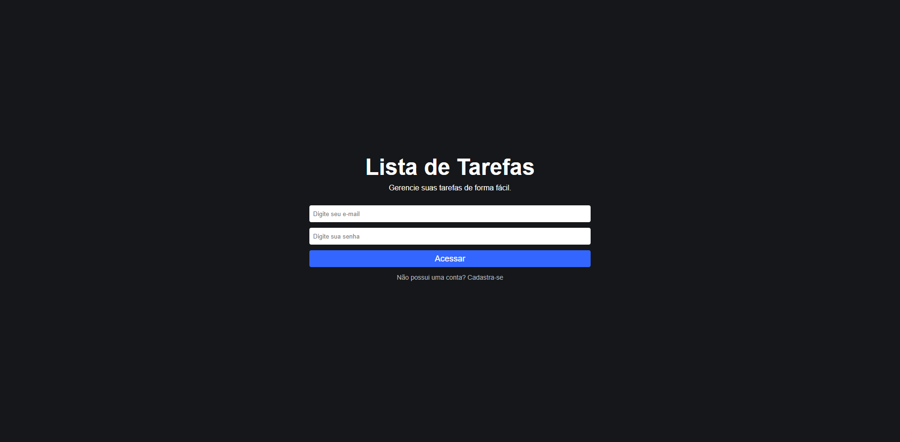
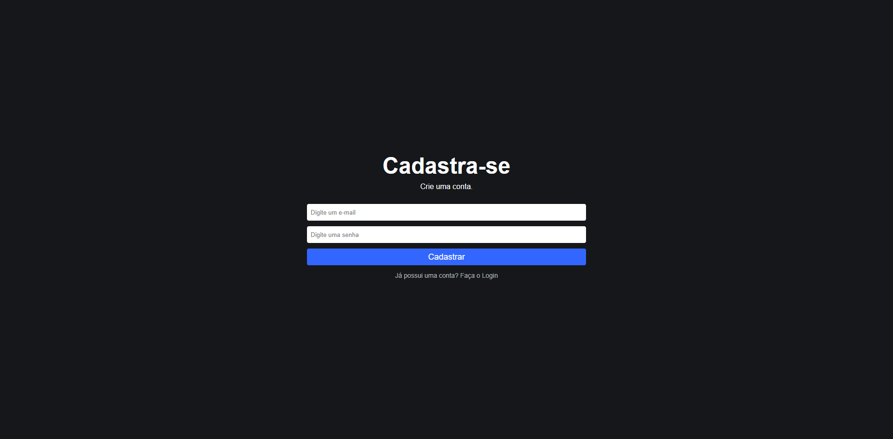
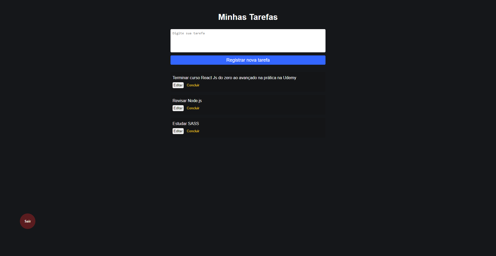

# Firebase App

Esse projeto foi desenvolvido durante o curso React Js do zero ao avançado na prática de Matheus Fraga na Udemy.

## Tecnologias utilizadas

Esse projeto foi desenvolvido com as seguintes tecnologias:

- JavaScript;
- React.js;
- React Router Dom;
- Firebase.

## Sobre

O Firebase App é uma aplicação que permite que o usuário gerencie de forma fácil sua agenda de tarefas. Para isso, a aplicação permite o login ou o cadastro de um usuário e a visualização e o registro de uma nova tarefa. Também é possível editar uma tarefa e marcá-la como concluida.

## Visualização das telas no Desktop

    
    

    
    

## Instruções

- Certifique-se que você tem instalado na sua máquina **npm**.
- Pelo terminal navegue até a pasta do projeto utilizando `cd firebase-app`.
- Crie o arquivo `firebaseConnection.js` e adicione a ele todas as configurações do seu firebase.
- Execute o comando `npm install` para instalar as dependências.
- Após isso execute o comando `npm start` e a aplicação deverá ser inicializada em uma aba no seu navegador.
